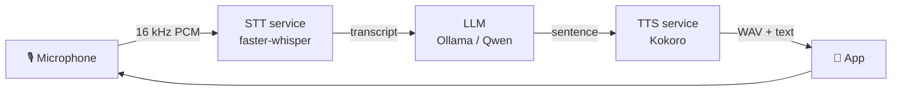
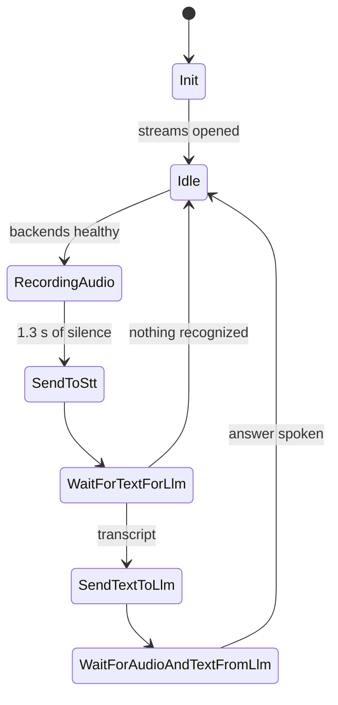

# Conversation

A hands-free voice assistant for **Android, iOS and Desktop**, sharing one Kotlin Multiplatform
codebase — including the networking. You speak, it listens, transcribes, asks a local LLM, and
speaks the answer back. No push-to-talk: the app runs a conversation loop that decides by itself
when you have finished a sentence.

Everything runs locally — speech recognition, the language model and speech synthesis are all
self-hosted, so no audio leaves the machine.

```
Kotlin 2.4 · Compose Multiplatform 1.11 · kotlinx-rpc gRPC (incl. Kotlin/Native) · coroutines & Flow
```

> **The part worth looking at:** the entire pipeline — bidirectional gRPC streaming, the audio
> pipeline and the conversation state machine — lives in `commonMain`. `expect/actual` is used only
> where the hardware genuinely differs: microphone capture and WAV playback.

---

## What it does



The app records until you fall silent, sends the utterance for transcription, forwards the text to
a locally hosted LLM, then plays each sentence of the reply as it is synthesized — showing the same
text on screen as it speaks. Then it starts listening again.

## The conversation loop

The core of the app is an explicit state machine (`ConversationState`) that runs forever. A single
**Stop** button cancels the turn in flight; the machine drops back to `Idle` and starts listening
again on its own.



Because the loop is linear, the microphone is only open during `RecordingAudio` — the assistant
cannot hear its own playback and mistake it for the next question.

## Architecture

```
core ──────────► app:shared ──────► androidApp / desktopApp / iosApp
(domain)         (Compose UI)       (entry points, 12–44 lines each)
```

| Module | Contains |
| --- | --- |
| `core` | State machine, repository, gRPC clients, audio capture and playback. Targets `jvm`, `android`, `iosArm64`, `iosSimulatorArm64`. |
| `app:shared` | Compose Multiplatform UI and `ConversationViewModel`, shared by all three apps. |
| `app:androidApp` · `desktopApp` · `iosApp` | Thin platform entry points. |
| `server` | Unrelated Ktor hello-world stub; not part of the pipeline. |

Layering is `ViewModel → ConversationManager → ConversationRepository → gRPC clients`.
`ConversationRepository` is an interface, so the state machine is tested against a fake backend
with no network and no hardware.

**Platform-specific code is confined to three small files per platform:** `AudioRecorder`,
`AudioPlayer` and `randomUuid`. All are real implementations — `AudioRecord`/`AudioTrack` on
Android, `AVAudioEngine`/`AVAudioPlayer` on iOS (resampling 48 kHz Float32 down to the 16 kHz Int16
the backend expects), and `javax.sound.sampled` on the JVM.

## Running it

### 1. Backends

Two gRPC services plus a local LLM, all on `localhost`:

| Service | Port | Runs |
| --- | --- | --- |
| STT | 8001 | [faster-whisper](https://github.com/SYSTRAN/faster-whisper) `large-v3-turbo` |
| TTS | 8000 | [Kokoro](https://github.com/hexgrad/kokoro), driven by an LLM through Ollama's OpenAI-compatible API |
| Ollama | 11434 | e.g. `qwen2.5:14b-instruct-q8_0` |

They live in a separate Python project and are not part of this repository. Any implementation of
[`stt.proto`](core/src/commonMain/proto/stt.proto) and [`tts.proto`](core/src/commonMain/proto/tts.proto)
will do:

```protobuf
service SttService { rpc Transcribe(stream AudioChunk) returns (stream Transcript); }
service TtsService { rpc Synthesize(stream TextPiece)  returns (stream AudioData); }
```

Two things the contract does not show, but the app depends on:

- An `AudioChunk` with `end_of_utterance = true` is what makes the backend transcribe.
- Each `Synthesize` stream is **one conversation** — the backend keeps the LLM chat history per
  stream, which is why the app holds a single stream open for the whole session instead of
  reconnecting per turn.

### 2. Apps

```bash
./gradlew :app:desktopApp:run              # Desktop (hot reload: :app:desktopApp:hotRun --auto)
./gradlew :app:androidApp:assembleDebug    # Android APK
# iOS: open app/iosApp in Xcode and run from there
```

Desktop and the **Android emulator** work as-is: the emulator reaches the host through the alias
`10.0.2.2`, which the app selects automatically (`defaultServerHost()`).

On a **physical phone**, `127.0.0.1` is the phone itself. Either forward the ports over USB:

```bash
adb reverse tcp:8000 tcp:8000 && adb reverse tcp:8001 tcp:8001
```

…or, to reach the machine over Wi-Fi instead, hand the clients its LAN address — they take a host
parameter, so no constant needs editing:

```kotlin
GrpcConversationRepository(SttClient(host = "192.168.1.x"), TtsClient(host = "192.168.1.x"))
```

The same applies to a physical iPhone, which has no `adb reverse` equivalent — use the LAN address.
The backends must then listen on `0.0.0.0` rather than loopback.

## Testing

```bash
./gradlew :core:jvmTest                                            # everything below
./gradlew :core:jvmTest --tests "com.pibi.conversation.manager.*"  # no hardware, no backends needed
```

| Test | Covers |
| --- | --- |
| `ConversationStateMachineTest` | Every state in order, the loop, and Stop from any state — fake backend, virtual time. |
| `ConversationResilienceTest` | Reconnection of either stream, a question surviving a reconnect, and that no turn starts while a backend is down. |
| `AudioRecorderReleaseTest` | That the microphone is handed back between utterances (a regression test — see below). |
| `SttGrpcSmokeTest` | The real gRPC stack against an in-process server. |
| `ConversationEndToEndTest` | The whole pipeline against the real backends, driven by a recorded question. Skips itself when they are not running. |

## Engineering notes

Four decisions and one bug that shaped this code:

**gRPC from Kotlin/Native.** Networking lives in `commonMain`, iOS included, using kotlinx-rpc dev
builds (`0.11.0-grpc-189`) — the stable release is JVM-only. The API is experimental and
version-locked: the `grpc-java` version has to match the one kotlinx-rpc bundles exactly, or it
compiles cleanly and throws `AbstractMethodError` at runtime.

**One stream per session, not per turn.** The backend keeps the LLM's memory per stream, so the app
holds both streams open for the whole conversation. Everything the streams produce is funneled into
channels, so each state picks up the event it expects rather than racing a shared collector.

**Streams are supervised.** Both clients originally swallowed failures with
`catch (Exception) { println(...) }`, so a backend restart ended the collector *normally* — and
questions were then dropped into a `SharedFlow` with no subscriber. The session was dead with no
error shown, every turn silently timing out. Now failures propagate, streams reconnect with
exponential backoff, health is reported in the UI, and questions wait on a `Channel` until the
stream is back.

**Cooperative cancellation is not free.** The JVM recorder read audio in a `while (true)` loop using
`trySend`. Neither suspends, so cancellation never took effect: the `TargetDataLine` leaked, and
every later recording blocked forever on a device that would never deliver. The app sat on
"Listening…" with no error. The fix — `isActive`, a suspending `send`, and closing the line in
`awaitClose` — ships with a regression test that fails against the old code.

**One heuristic remains.** The TTS contract carries no end-of-answer marker, so the app treats a gap
in the audio stream as "the assistant stopped talking". Adding a marker to the proto would turn that
guess into a fact.

## Security (and what production would need)

This runs as a **local development setup**, and its trust boundary is your own machine. Worth being
explicit about, since the choices below are deliberate rather than overlooked:

| Today | Why it is acceptable here | What production needs |
| --- | --- | --- |
| gRPC over plaintext (`credentials = plaintext()`) | Traffic never leaves the loopback interface | TLS, with the backends holding a certificate |
| No authentication on either service | Anything that can reach the port is already on your machine | Per-client credentials, checked by an interceptor |
| Android `usesCleartextTraffic="true"` | Needed to reach the backends over plain HTTP/2 | Drop it, or scope it to the dev host with a network security config |
| Backends bind `0.0.0.0` | Convenient for reaching them from a phone | Bind loopback, or firewall the ports |

The last two combine into the one thing to actually watch: with the services on `0.0.0.0` and no
authentication, **anyone on the same network can send audio to your STT service and prompts to your
LLM**. On a home network that is a curiosity; on a café's Wi-Fi it is an open microphone-transcription
and text-generation service running on your laptop. Bind to `127.0.0.1` unless you are deliberately
testing from a phone.

What the app does *not* do is worth stating too: **no audio, transcript or reply ever leaves the
machine**. Speech recognition, the language model and speech synthesis are all self-hosted, there is
no telemetry, and the repository contains no credentials — the only key-shaped string is the literal
`"ollama"` that Ollama's OpenAI-compatible endpoint ignores.

Microphone access is requested properly on every platform: `RECORD_AUDIO` at runtime on Android,
`NSMicrophoneUsageDescription` on iOS, and the same declaration in the packaged macOS bundle —
without which macOS terminates the app the moment it opens the microphone. iOS needs no App
Transport Security exception, because gRPC does not go through `NSURLSession`.

## License

Copyright © 2026 Piotr Błochowiak. All rights reserved — see [LICENSE](LICENSE).

Published for portfolio review: read it, run it locally, but it is not open source and no
permission is granted to reuse it.

## Repository layout

```
core/src/
  commonMain/            state machine, repository, gRPC clients, proto contracts
  {android,ios,jvm}Main/ microphone capture and WAV playback
  commonTest/            state machine and resilience tests (fakes, virtual time)
  jvmTest/               gRPC smoke test, end-to-end test, microphone regression test
app/
  shared/                Compose UI + ViewModel
  androidApp/ desktopApp/ iosApp/   platform entry points
```
